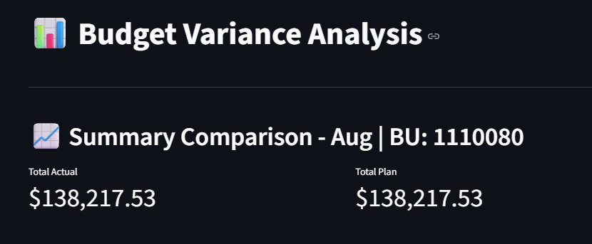

# Financial App

This project contains a **Streamlit-based financial dashboard** to visualize and interact with budget and actuals (BvA) data from a corporate finance database. 

The app loads financial Excel reports and displays summary and detailed views for decision-making.

You can access the app here: [[http://localhost:8501](https://bva-finance.streamlit.app/)](https://bva-finance.streamlit.app/))

## Overview

Below is a preview of the Streamlit dashboard:




## 🚀 How to Run the App

1. **Install dependencies**

```bash
pip install -r requirements.txt
```

2. **Run the app**

```bash
streamlit run jde_app.py
```

3. **Navigate to**

Open your browser and go to: [http://localhost:8501](http://localhost:8501)

---


## 📄 File Descriptions

| File                   | Description                                                                                           |
|------------------------|-------------------------------------------------------------------------------------------------------|
| `jde_app.py`           | Main script to launch the Streamlit app. Loads and processes Excel inputs.                            |
| `requirements.txt`     | List of required Python packages.                                                                     |
| `budget_plan.xlsx`     | Primary Excel data source for Budget vs Actuals (BvA), simulating an official corporate finance database. |
| `account_details.xlsx` | Detailed view of financials, per business unit or account.                                            |

